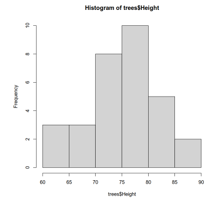

# Visualizando de Dados no R
Autor: Wellington Moreira

<p align='center'>
    
</p>


### **Introdução**

No universo da análise de dados, a visualização é uma habilidade essencial para entender padrões e relações em datasets. Este guia traz um guia prático para criar e personalizar gráficos básicos no R, utilizando os datasets nativos: CO2 e trees. Se você é analista de dados ou está em transição para essa área, esta é a oportunidade de elevar suas habilidades em visualização.

---

### **1. Histograma: Explorando Distribuições**

Um histograma é usado para visualizar a frequência de uma variável numérica contínua.

### **Exemplo 1.1: Criando um histograma básico**

```r
# Visualizar a distribuição da altura das árvores
hist(trees$Height)

```



**Explicação**: O histograma mostra em quais intervalos de altura há maior ou menor frequência. Por exemplo, a maioria das árvores pode ter entre 70 e 80 unidades de altura.

### **Exemplo 1.2: Adicionando personalizações**

```r
# Adicionando título, rótulos e cor
hist(trees$Height,
     main = "Distribuição das Alturas das Árvores",
     xlab = "Altura",
     ylab = "Frequência",
     col = "blue")

```


**Personalizações**:

- `main`: Define o título do gráfico.
- `xlab` e `ylab`: Rótulos para os eixos X e Y.
- `col`: Define a cor do histograma.

### **Exemplo 1.3: Ajustando densidade e intervalos (breaks)**

```r
# Alterando densidade de preenchimento e número de intervalos
hist(trees$Height,
     main = "Distribuição das Alturas",
     xlab = "Altura",
     ylab = "Frequência",
     col = "blue",
     density = 20,
     breaks = 20)

```


**Explicação**:

- `density`: Adiciona uma textura ao preenchimento do gráfico.
- `breaks`: Aumenta o número de intervalos, tornando o gráfico mais detalhado.

---

### **2. Densidade: Visualização Suavizada**

Gráficos de densidade mostram a distribuição de dados em uma linha contínua.

### **Exemplo 2.1: Criando um gráfico de densidade**

```r
# Calculando e plotando a densidade
densidade <- density(trees$Height)
plot(densidade,
     main = "Densidade da Altura das Árvores",
     xlab = "Altura",
     ylab = "Densidade")

```


**Explicação**:

- A função `density` calcula os dados suavizados.
- O gráfico exibe uma linha contínua que representa a frequência relativa das alturas.

### **Exemplo 2.2: Sobrepondo densidade e histograma**

```r
# Criando histograma
hist(trees$Height, main = NULL, xlab = NULL, ylab = NULL)
par(new = TRUE)  # Permite sobrepor o próximo gráfico
# Adicionando a densidade
plot(densidade, col = "red", lwd = 2, main = "Histograma com Densidade")

```


**Explicação**:

- `par(new = TRUE)`: Sobrepõe o gráfico atual sem apagar o anterior.
- `col` e `lwd`: Controlam a cor e a espessura da linha da densidade.

---

### **3. Gráficos de Dispersão**

Gráficos de dispersão permitem analisar a relação entre duas variáveis contínuas.

### **Exemplo 3.1: Dispersão básica**

```r
# Comparando circunferência e volume
plot(trees$Girth, trees$Volume,
     main = "Dispersão: Circunferência vs Volume",
     xlab = "Circunferência",
     ylab = "Volume")

```


**Explicação**:

- Este gráfico mostra uma relação positiva: quanto maior a circunferência, maior o volume.

### **Exemplo 3.2: Adicionando personalizações**

```r
# Alterando elementos visuais
plot(trees$Girth, trees$Volume,
     main = "Dispersão: Circunferência vs Volume",
     xlab = "Circunferência",
     ylab = "Volume",
     col = "blue",
     pch = 20)

```


**Personalizações**:

- `col`: Define a cor dos pontos.
- `pch`: Define o estilo dos pontos (20 cria pontos preenchidos).

### **Exemplo 3.3: Adicionando tremulação (jitter)**

```r
# Evitando sobreposição de pontos
plot(jitter(trees$Girth), trees$Volume,
     main = "Dispersão com Tremulação",
     xlab = "Circunferência",
     ylab = "Volume",
     col = "blue")

```


**Explicação**:

- `jitter`: Adiciona pequenos desvios aleatórios para evitar sobreposição.

---

### **4. Trabalhando com Variáveis Categóricas**

Podemos usar cores para representar categorias em gráficos.

### **Exemplo 4.1: Adicionando uma variável categórica**

```r
# Comparando concentração e absorção de CO2
plot(CO2$conc, CO2$uptake,
     col = CO2$Treatment,
     pch = 20,
     main = "Dispersão: Concentração vs Absorção de CO2")
```


**Explicação**:

- `col`: Cada categoria (`Treatment`) recebe uma cor diferente.

### **Exemplo 4.2: Adicionando uma legenda**

```r
# Adicionando legenda
legend("bottomright",
       legend = c("Non-chilled", "Chilled"),
       fill = c("black", "red"),
       title = "Tratamento")

```


**Explicação**:

- `legend`: Adiciona uma explicação das cores no gráfico.

---

### **5. Divisão de Telas**

Podemos exibir múltiplos gráficos em uma única saída.

### **Exemplo 5.1: Dividindo a tela**

```r
# Dividindo a tela em 4 partes
split.screen(figs = c(2, 2))

# Gráfico 1
screen(1)
plot(trees$Girth, trees$Volume, main = "Circunferência vs Volume")

# Gráfico 2
screen(2)
plot(trees$Girth, trees$Height, main = "Circunferência vs Altura")

# Gráfico 3
screen(3)
plot(trees$Height, trees$Volume, main = "Altura vs Volume")

# Gráfico 4
screen(4)
hist(trees$Volume, main = "Histograma do Volume")

# Fechar as telas
close.screen(all = TRUE)

```


**Explicação**:

- `split.screen(figs = c(2, 2))`: Divide a tela em 4 seções (2x2).
- `screen(n)`: Define em qual seção o próximo gráfico será exibido.

---

### **Considerações finais**

Esses exemplos mostram como criar e personalizar gráficos no R de forma detalhada e prática:

1. **Histograma:** Analise distribuições de uma variável.
2. **Densidade:** Visualize distribuições suavizadas.
3. **Dispersão:** Compare relações entre variáveis contínuas.
4. **Categorias:** Destaque grupos com cores.
5. **Divisão de tela:** Organize múltiplas visualizações.